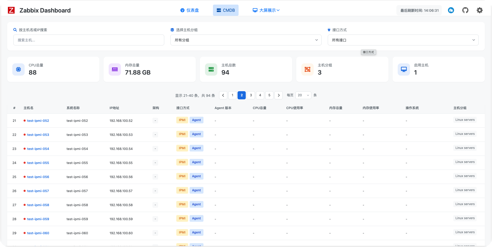

# zabbix_browser_addons

[English](README_EN.md) | 简体中文

## 项目简介
这是一个基于 Chrome/Edge 浏览器的 Zabbix 监控系统扩展插件，提供更便捷的 Zabbix 监控体验。通过此插件，用户可以快速查看和管理 Zabbix 监控数据，无需频繁切换页面。支持标签页管理和快速 URL 访问功能。

## 主要功能
- 快速查看 Zabbix 监控数据
- 实时告警通知
- 监控数据可视化展示
- 兼容环境：zabbix 6.0.48、zabbix 7.0.21、zabbix 7.4.6

## 项目截图

## 插件市场安装地址
### Chrome
[https://chromewebstore.google.com/detail/zabbix-dashboard/kcnnfpddapjgflocpeojnobdolfaejaa](https://chromewebstore.google.com/detail/zabbix-dashboard/kcnnfpddapjgflocpeojnobdolfaejaa)
  
### Edge
[https://microsoftedge.microsoft.com/addons/detail/zabbix-dashboard/ccpgeajnamiengocljojcaapifmljiif](https://microsoftedge.microsoft.com/addons/detail/zabbix-dashboard/ccpgeajnamiengocljojcaapifmljiif)

## 更新日志
### [4.0.0] - 2025-10-12
#### 新增 / New Features
- **支持 Zabbix 6.x 版本**: 插件现已兼容 Zabbix 6.x 版本，确保在最新版本的 Zabbix 上正常运行
- **多语言支持增强**: 优化了国际化支持，提升了多语言环境下的用户体验
- **删除了主机列表页面**: 为简化用户界面，移除了主机列表页面
- **新增了 CMDB 页面**: 添加了 CMDB 页面
### [3.0.4] - 2025-10-12
#### 改进 / Improvements
- **API认证方式更新**: 根据Zabbix官方文档建议，将API认证方式从请求体中的`auth`属性改为使用`Authorization: Bearer <token>`头部认证
- **API Authentication Update**: Following Zabbix official documentation recommendations, changed API authentication from `auth` property in request body to `Authorization: Bearer <token>` header authentication

## 源码安装方法
1. 下载项目代码
   - 下载地址：https://github.com/X-Mars/zabbix_browser_addons
   - 下载后解压到本地目录
2. 在 Chrome/Edge 浏览器中打开扩展管理页面
   - Chrome: 访问 `chrome://extensions/`
   - Edge: 访问 `edge://extensions/`
3. 开启"开发者模式"
3. 点击"加载已解压的扩展程序"，选择项目目录

## 使用说明
### 初始配置
1. 配置 Zabbix 服务器信息
   - 服务器地址
   - API Token/用户认证信息
   - 刷新间隔

3. 点击浏览器工具栏的插件图标即可使用

### 功能使用
- 监控面板：展示关键监控指标
- 告警列表：显示最新告警信息
- 数据图表：可视化展示监控数据
- 设置中心：个性化配置选项

## 项目结构

## 开发指南
1. 克隆项目
2. 按照安装方法加载插件
3. 修改代码后刷新插件即可

## 许可证
MIT License
