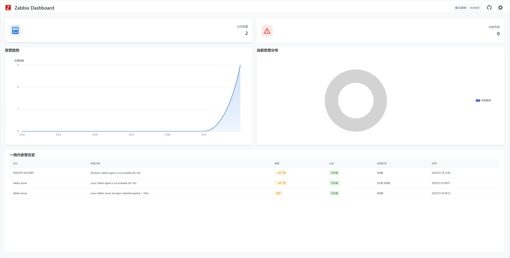
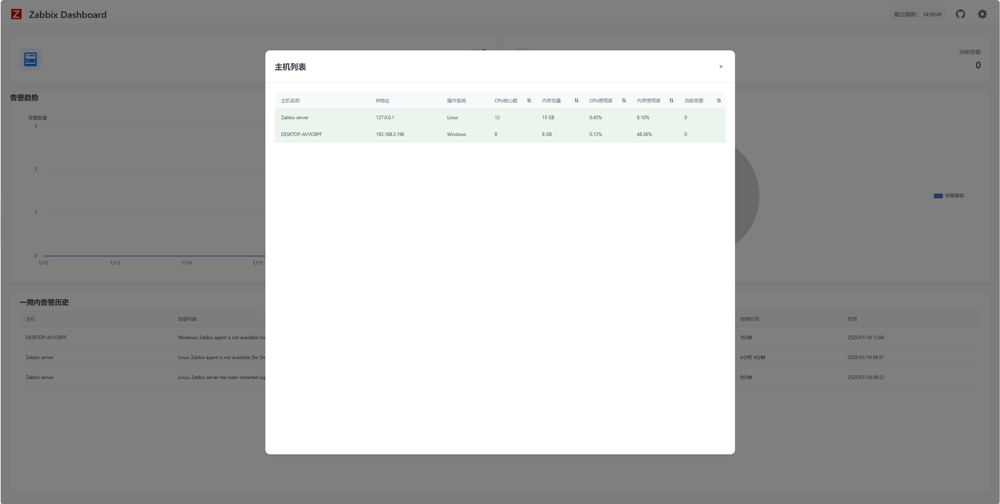
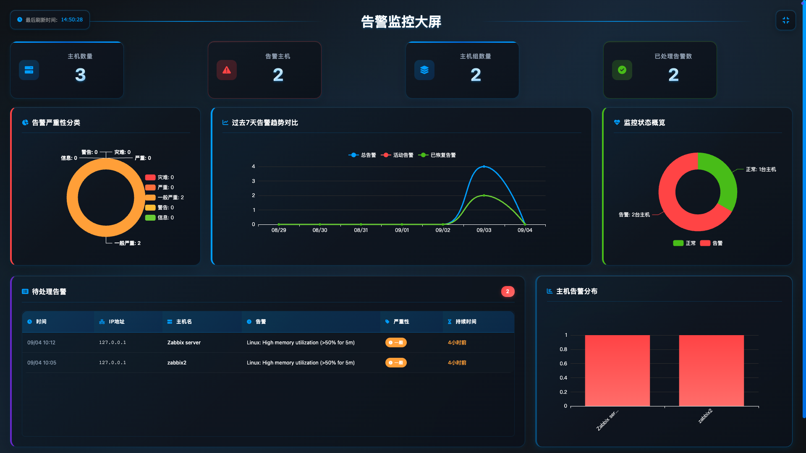
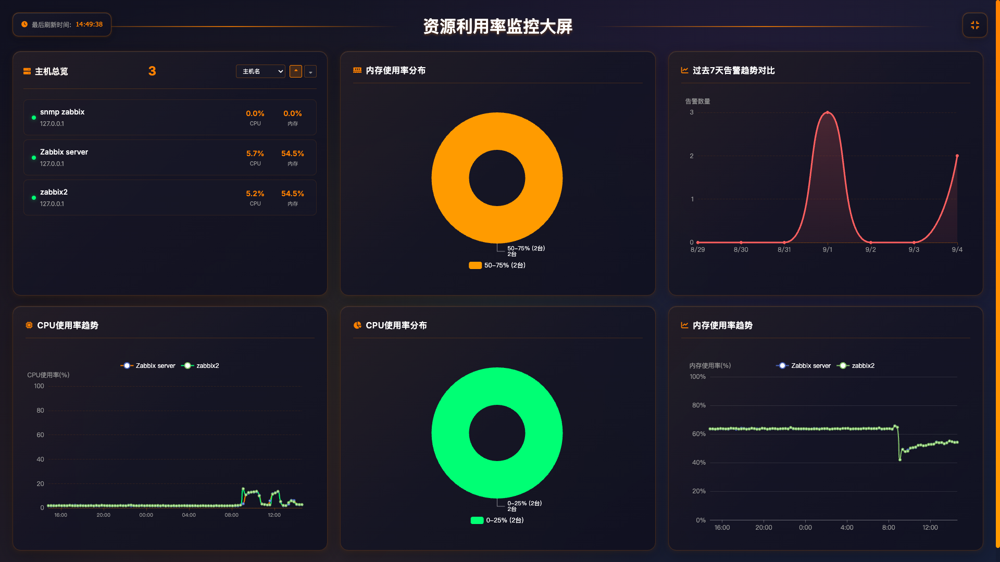
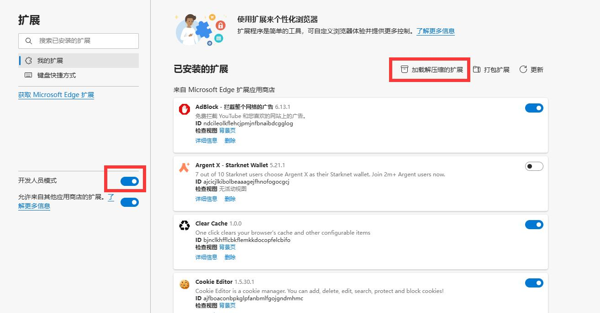
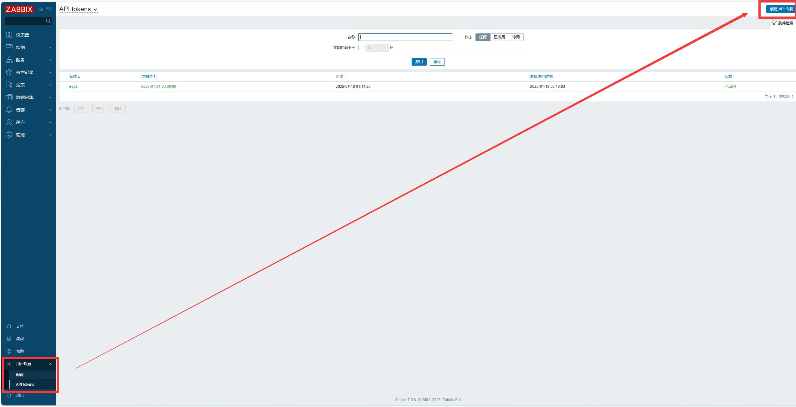
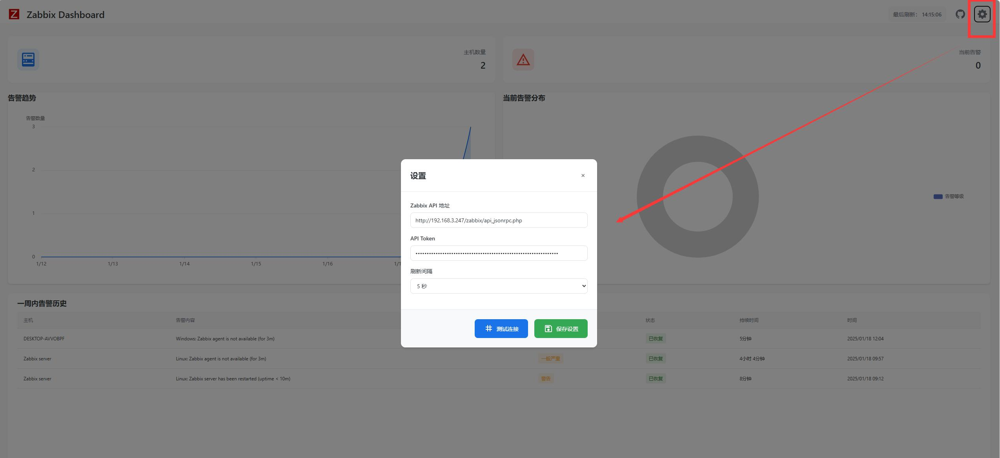

# zabbix_browser_addons

[English](README_EN.md) | 简体中文

## 项目简介
这是一个基于 Chrome/Edge 浏览器的 Zabbix 监控系统扩展插件，提供更便捷的 Zabbix 监控体验。通过此插件，用户可以快速查看和管理 Zabbix 监控数据，无需频繁切换页面。支持标签页管理和快速 URL 访问功能。

## 主要功能
- 快速查看 Zabbix 监控数据
- 实时告警通知
- 监控数据可视化展示

## 项目截图

## 插件市场安装地址
### Chrome
[https://chromewebstore.google.com/detail/zabbix-dashboard/kcnnfpddapjgflocpeojnobdolfaejaa](https://chromewebstore.google.com/detail/zabbix-dashboard/kcnnfpddapjgflocpeojnobdolfaejaa)
  
### Edge
[https://microsoftedge.microsoft.com/addons/detail/zabbix-dashboard/ccpgeajnamiengocljojcaapifmljiif](https://microsoftedge.microsoft.com/addons/detail/zabbix-dashboard/ccpgeajnamiengocljojcaapifmljiif)

## 源码安装方法
1. 下载项目代码
   - 下载地址：https://github.com/X-Mars/zabbix_browser_addons
   - 下载后解压到本地目录
2. 在 Chrome/Edge 浏览器中打开扩展管理页面
   - Chrome: 访问 `chrome://extensions/`
   - Edge: 访问 `edge://extensions/`
3. 开启"开发者模式"
3. 点击"加载已解压的扩展程序"，选择项目目录

## 使用说明
### 初始配置
1. 配置 Zabbix 服务器信息
   - 服务器地址
   - API Token/用户认证信息
   - 刷新间隔

3. 点击浏览器工具栏的插件图标即可使用

### 功能使用
- 监控面板：展示关键监控指标
- 告警列表：显示最新告警信息
- 数据图表：可视化展示监控数据
- 设置中心：个性化配置选项

## 项目结构

## 开发指南
1. 克隆项目
2. 按照安装方法加载插件
3. 修改代码后刷新插件即可

## 许可证
MIT License
