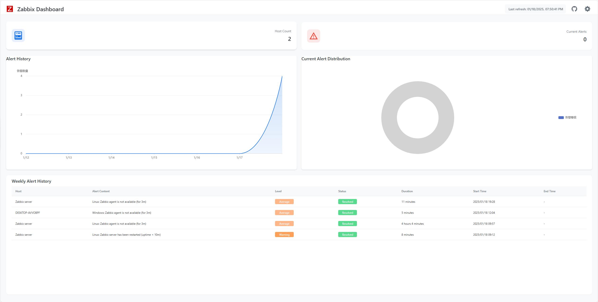
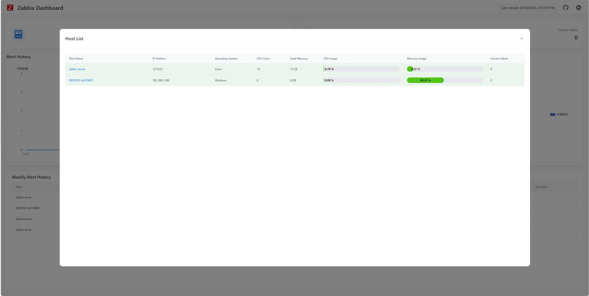
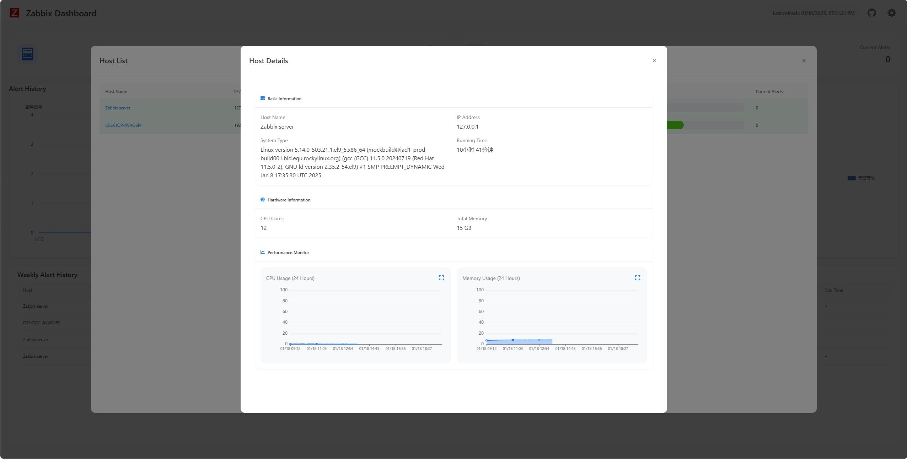
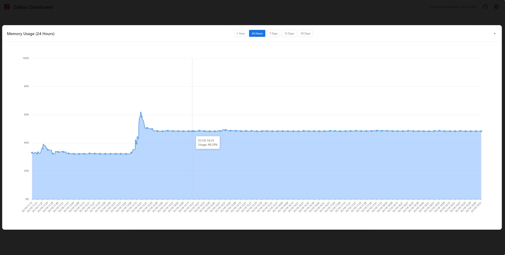
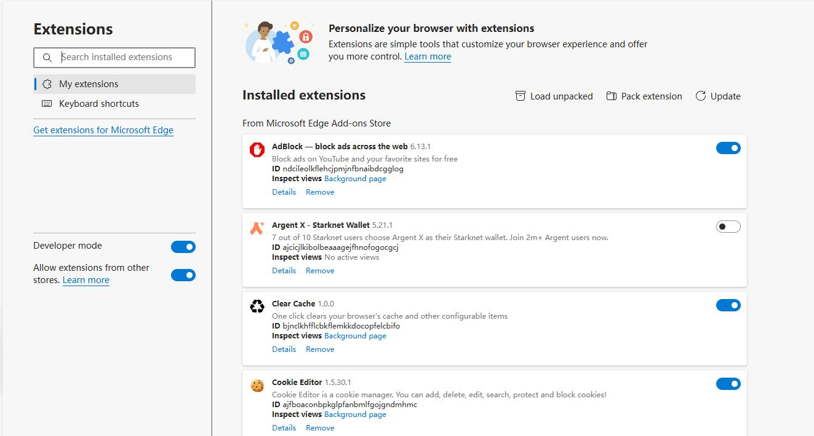
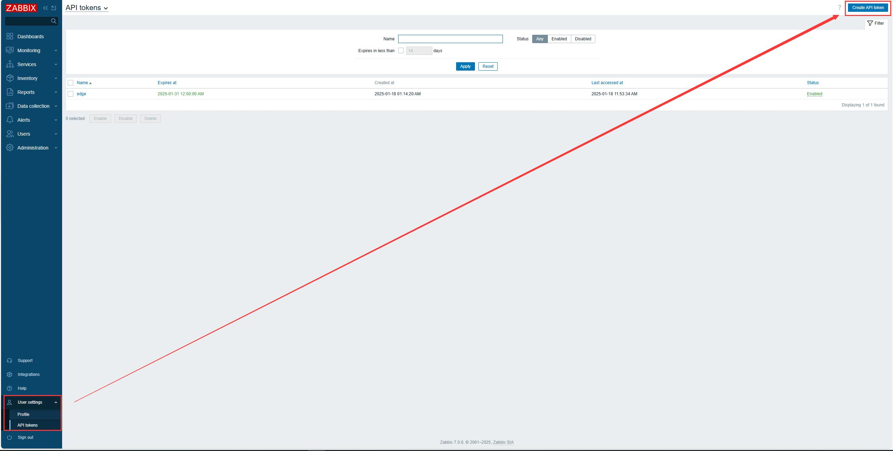
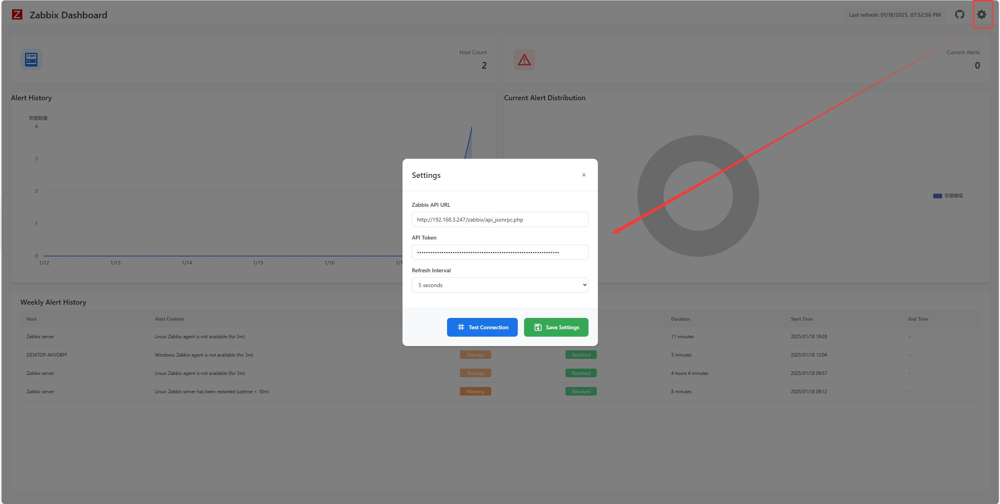

# Zabbix Browser Extension

English | [简体中文](README.md)

## Introduction
This is a Chrome/Edge browser extension for the Zabbix monitoring system, providing a more convenient monitoring experience. Users can quickly view and manage Zabbix monitoring data without frequently switching pages. It supports tab management and quick URL access functionality.

## Key Features
- Quick access to Zabbix monitoring data
- Real-time alert notifications
- Monitoring data visualization
- Multi-language support (English/Chinese)

## Screenshots

## Webstore Url
### Chrome
[https://chromewebstore.google.com/detail/zabbix-dashboard/kcnnfpddapjgflocpeojnobdolfaejaa](https://chromewebstore.google.com/detail/zabbix-dashboard/kcnnfpddapjgflocpeojnobdolfaejaa)
  
### Edge
[https://microsoftedge.microsoft.com/addons/detail/zabbix-dashboard/ccpgeajnamiengocljojcaapifmljiif](https://microsoftedge.microsoft.com/addons/detail/zabbix-dashboard/ccpgeajnamiengocljojcaapifmljiif)

## Source Installation
1. Download the project code
   - Download from: https://github.com/X-Mars/zabbix_browser_addons
   - Extract to a local directory
2. Open the extension management page in Chrome/Edge
   - Chrome: Navigate to `chrome://extensions/`
   - Edge: Navigate to `edge://extensions/`
3. Enable "Developer mode"
4. Click "Load unpacked" and select the project directory

## Usage Guide
### Initial Setup
1. Configure Zabbix server information
   - Server address
   - API Token/Authentication information
   - Refresh interval

2. Click the extension icon in the browser toolbar to start using

### Features
- Dashboard: Display key monitoring metrics
- Alert List: Show latest alert information
- Data Charts: Visualize monitoring data
- Settings Center: Personalization options

## Project Structure 