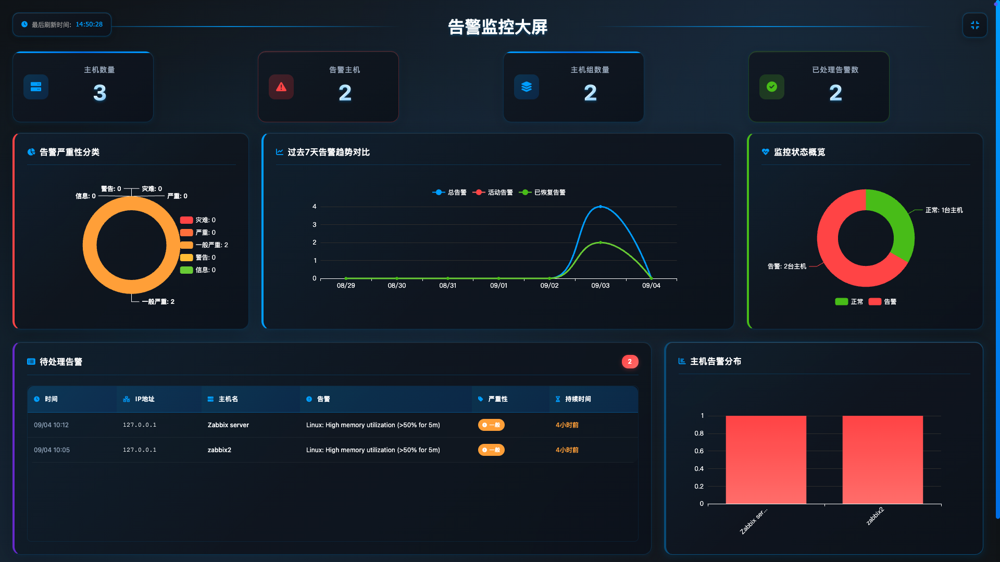
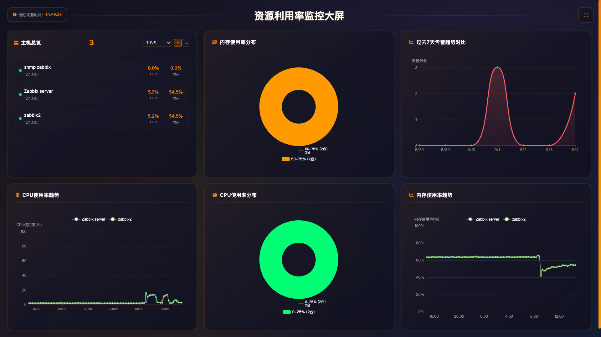

# zabbix_browser_addons

English | [简体中文](README.md)

## Introduction

This is a Chrome/Edge browser extension for the Zabbix monitoring system, providing a more convenient monitoring experience. With this extension, users can quickly view and manage Zabbix monitoring data without frequently switching pages. It supports tab management and quick URL access functionality.

## Key Features

- Quick access to Zabbix monitoring data
- Real-time alert notifications
- Monitoring data visualization
- Compatible environments: Zabbix 6.0.48, Zabbix 7.0.21, Zabbix 7.4.6, Zabbix 8.0.0 pre

## Screenshots

## Extension Store Installation

### Chrome

[https://chromewebstore.google.com/detail/zabbix-dashboard/kcnnfpddapjgflocpeojnobdolfaejaa](https://chromewebstore.google.com/detail/zabbix-dashboard/kcnnfpddapjgflocpeojnobdolfaejaa)
  
### Edge

[https://microsoftedge.microsoft.com/addons/detail/zabbix-dashboard/ccpgeajnamiengocljojcaapifmljiif](https://microsoftedge.microsoft.com/addons/detail/zabbix-dashboard/ccpgeajnamiengocljojcaapifmljiif)

## Changelog

### [4.1.0] - 2025-02-27

#### New Features

- **2 New Dashboard Pages**: Added two new full-screen dashboard pages — Comprehensive Monitoring Dashboard and Service Availability Dashboard
- **CMDB Page Pagination**: Added pagination to the CMDB page, improving data readability and user experience

### [4.0.0] - 2025-10-12

#### New Features

- **Zabbix 6.x Support**: The extension is now compatible with Zabbix 6.x, ensuring proper functionality on the latest Zabbix versions
- **Enhanced Multi-language Support**: Improved internationalization support for a better user experience in multi-language environments
- **Removed Host List Page**: Removed the host list page to simplify the user interface
- **New CMDB Page**: Added a new CMDB page

### [3.0.4] - 2025-10-12

#### Improvements

- **API Authentication Update**: Following Zabbix official documentation recommendations, changed API authentication from `auth` property in request body to `Authorization: Bearer <token>` header authentication

## Source Installation

1. Download the project code
   - Download from: https://github.com/X-Mars/zabbix_browser_addons
   - Extract to a local directory
2. Open the extension management page in Chrome/Edge
   - Chrome: Navigate to `chrome://extensions/`
   - Edge: Navigate to `edge://extensions/`
3. Enable "Developer mode"
4. Click "Load unpacked" and select the project directory

## Usage Guide

### Initial Setup

1. Configure Zabbix server information
   - Server address
   - API Token / User authentication information
   - Refresh interval

2. Click the extension icon in the browser toolbar to start using

### Features

- Monitoring Dashboard: Display key monitoring metrics
- Alert List: Show latest alert information
- Data Charts: Visualize monitoring data
- Settings Center: Personalization options

## Project Structure

## Development Guide

1. Clone the project
2. Load the extension following the installation instructions above
3. Modify the code and refresh the extension to apply changes

## License

MIT License
